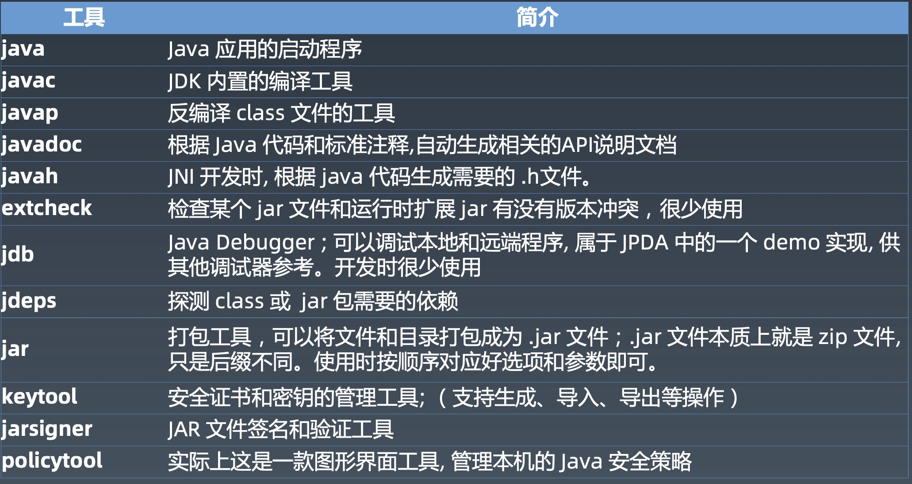
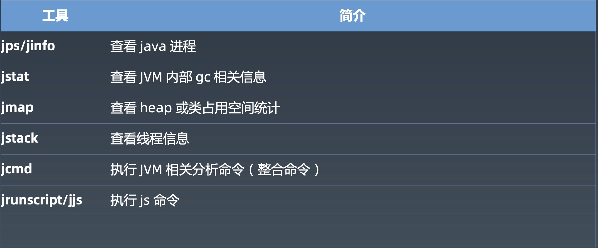
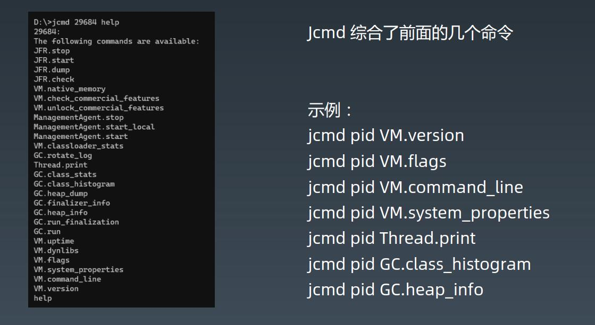

### JVM核心技术--工具与GC策略  

#### JVM命令行工具

> -Xms 设置堆内存 memory 的初始值(initial size),同时也是最小值(minimum).
> -Xmx 设置堆内存 memory 的最大值(maximum).
> -Xmn 在使用分代GC的内存管理器中，设置年轻代【young generation (nursery)】的初始值以及最大值.
> 详情请参考java命令参数文档: https://docs.oracle.com/en/java/javase/15/docs/specs/man/java.html

> -Xmx的mx和-Xms的ms是哪些单词嘛
> -X  memory start size;  -X memory max size

> https://docs.oracle.com/javase/8/docs/technotes/guides/vm/gctuning/parallel.html#default_heap_size
官方文档对jvm堆大小的行为有说明：
> 1G以上内存，xmx 1/4，初始堆1/64
> 如果你明确知道使用多少内存，可以xms=xmx
> 
>查看参数
> java -XX:+PrintFlagsFinal -version | grep MaxHeapSize

>你家存款有1024w（Xmx-单位m），你的CFO（GC）规定old老婆和young你占有比例2:1，所以你老婆占有的（最大值）是683w（old区最大值），你是341w（max new size），用jmap -heap去看的时候，就是你日常找你老婆申请零花钱，虽然你名义上有341w，但是你老婆看你一天也就抽包烟两顿饭，只给了你8k，这个8k就是young区的初始容量（远远不到新生代最大值341m）。注意，CFO一开始就可能给了你老婆100w。
>作为一个节俭的young男人，你把约摸着，你所有的钱，计划分三份用途（eden理财、S0吃饭、S1穿衣服），花的比例应用是8:1:1。
>这会儿你手上钱不多，，先得生存（survivor），估计得吃饭占大头，所以实际上你预计吃饭可能花多点1100(S0容量)，穿少点900(S1容量)，还有6000(eden容量)可以买理财，这时候你没法保证真正花的钱比例8:1:1，对吧，差不多6:1:1，但是你基本可以肯定，要是一下子把341w都给你，你就按这个比例来花。
>实际上，你可能今天买理财钱花了一半，吃饭钱1100实际上只用了300，买衣服基金没动。
>这样查看你的账户，
>EC  6000
>EU  3000
>S0C 1100
>S0U 300
>S1C 900
>S1   0

>移动 = 立即复制到新空间 + 立即释放旧空间， 可以认为额外的内存开销很小，或者说，移动很多个内存对象时，依次移动，比如移动1G的内存，那么就不需要额外的1G内存to空间来担保。
>复制时，一般是有个 to 空间概念的， 比如 S0或者S1，或者是老年代作为 copy-to 空间，如果这个空间不足就会报错。
>为什么采用复制算法，是由于分代假设以及GC的实现方式决定的，每次GC之后eden区都会整个“清空”，所以不在乎浪费一点空间。
>
- 钉钉群总结
> -XX:-UseAdaptiveSizePolicy -XX:SurvivorRatio=8
加这两个参数，能让严格8:1:1，并且s0和s1一样
注意，ratio之类的控制的比例都是最大值
当前young区很小的时候，各个指标到不了最大值，所以，默认UseAdaptiveSizePolicy开了的情况下，可能会有调整。
比如不是严格的8：1：1，S0和S1不一样大

>java -jar target\gateway-server-0.0.1-SNAPSHOT.jar
>java -jar -XX:-UseAdaptiveSizePolicy target\gateway-server-0.0.1-SNAPSHOT.jar
>java -jar -XX:-UseAdaptiveSizePolicy -XX:SurvivorRatio=8 target\gateway-server-0.0.1-SNAPSHOT.jar
>可以试试，jmap -heap都不太一样
>什么也不加，S0 S1不严格相等, 8:1:1也处于6:1:1~8:1:1之间，堆较小越偏向于8
>只加-XX:-UseAdaptiveSizePolicy，S0和S1相等了，比例不准确到8
>两个都加，严格的8：1：1，S0和S1一样大

>Java8 启动，要加命令远程jmx才能连 ：java -Djava.rmi.server.hostname=114.67.171.251  -Dcom.sun.management.jmxremote -Dcom.sun.management.jmxremote.port=8777 -Dcom.sun.management.jmxremote.rmi.port=8777 -Dcom.sun.management.jmxremote.authenticate=false -Dcom.sun.management.jmxremote.ssl=false

- jcmd命令

> 最大的young区是整个堆内存的1/3
> NewRatio=2 表示old区和young区为2:1
> MBean相当于一个远程rpc调用的接口列表
- GC的背景与一般原理
