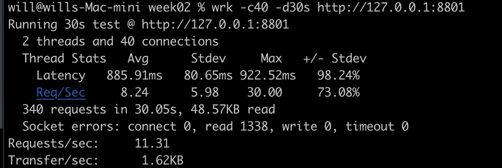
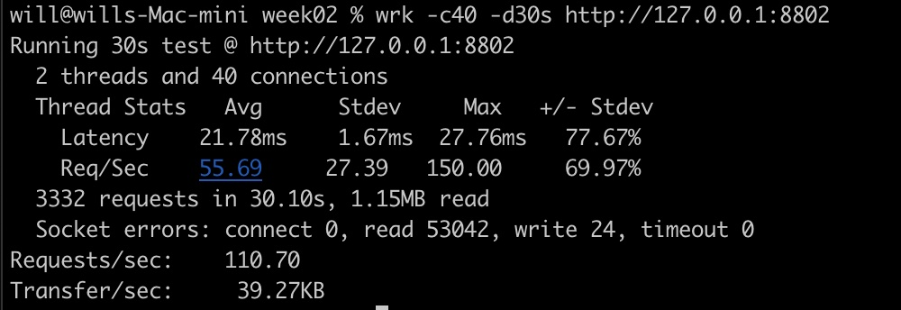

- HttpSerivce01使用wrk压测分析结果

  

- HttpService02使用wrk压测分析结果

> 多线程情况向请求明显增多
>
> java里的线程是个裸线程，它实际执行的时候，要直接去底层调用操作系统的creat thread 去创建线程，管理操作系统线程的生命周期，最后执行完再把操作系统真正的线程销毁掉，这样的话它创建了特别多的线程，整个线程的使用效率是比较低的，所以才会不管是java代码还是别的语言里，创建线程的时候，一般都会使用线程池

- HttpService03使用wrk压测分析结果

  

