- 执行 java  -XX:+PrintGCDetails  GCLogAnalysis 结果

  

- 将GC日志输出到文件，并且打印时间戳

  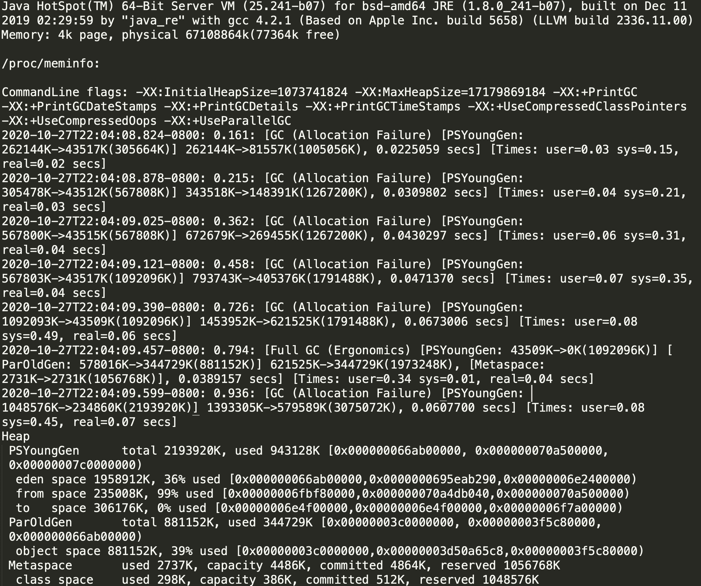

> Young区从26->4少了22 整个堆从26->8只少了18 中间差了4m在old区
>
> 我们每次GC，youngGC的话有一部分可能会提升到Old区，有一部分被复制，比如从S0复制到S1，每次youngGC的效率是比较高的，相当于把整个young区的大部分对象要么回收掉了，要么提升到old区了
>
> user表示用户线程使用的时间，sys 系统使用的时间， real暂停的时间 
>
> Java8 默认配的堆内存是系统的1/4

- 堆内存对系统的影响

  > Java -Xmx128m -XX:+PrintGCDetails GCLogAnalysis

  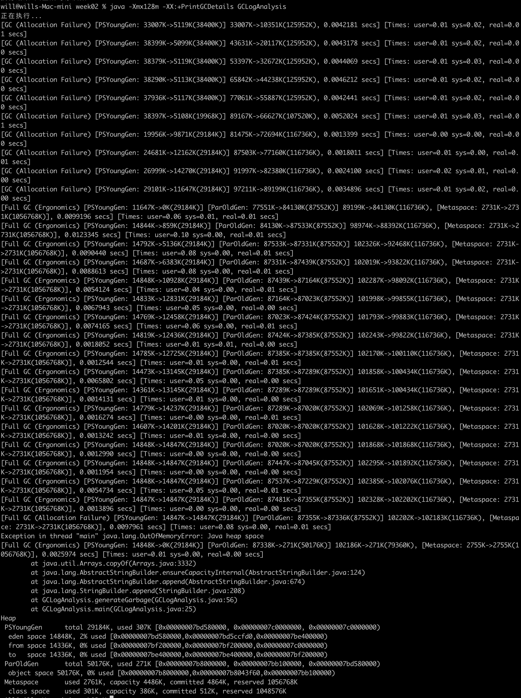

> 当堆内存特别小，就会导致程序很快没有内存用了，导致内存溢出 

> Java -Xmx256m -XX:+PrintGCDetails GCLogAnalysis

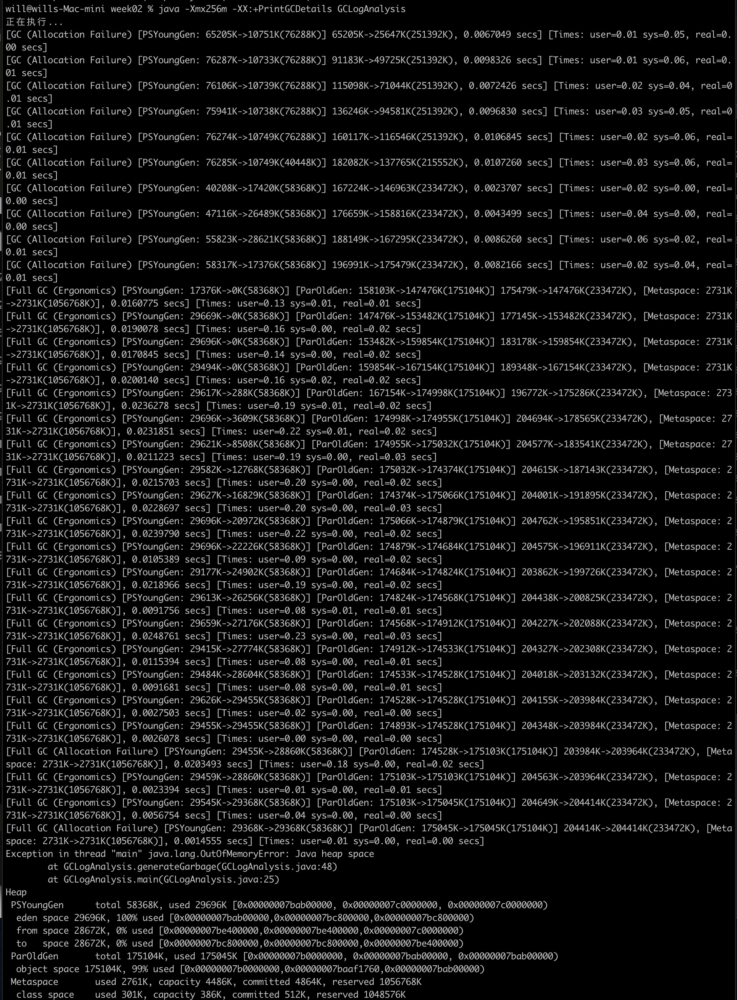

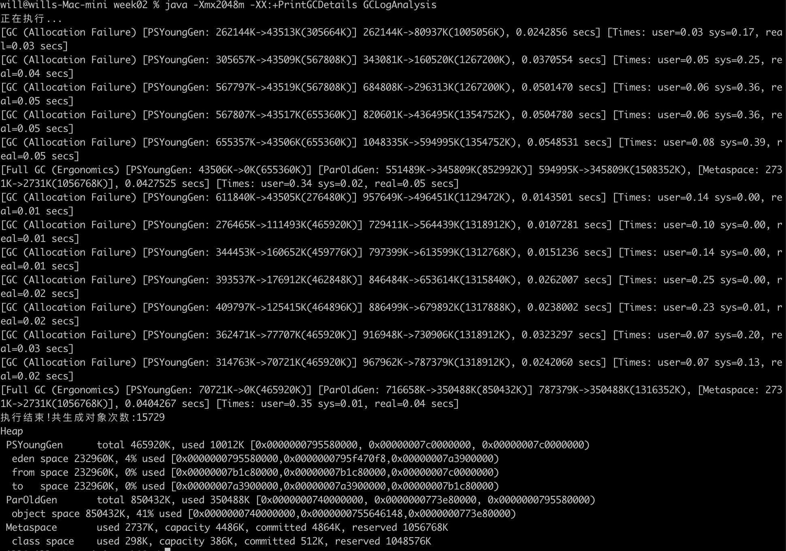

> 堆内存越大，程序运行效率越高，GC次数越少

> Minor GC(小型GC) 一般指yongGC
> Major GC(大型GC) 一般指oldGC

- 在不同GC下的表现 串行GC

  > Java -XX:+UseSerialGC -Xms512m -Xmx512m -Xloggc:gc.demo.log -XX:+PrintGCDetails -XX:+PrintGCDateStamps GCLogAnalysis

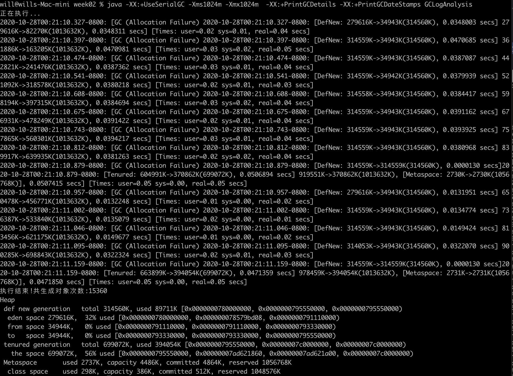

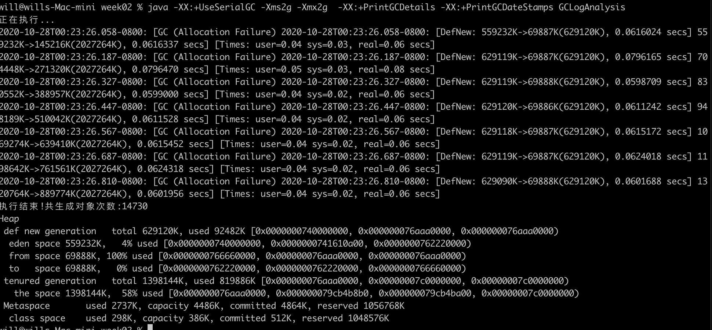

> 串行GC使用单线程做GC，GC效率比较低，时间会比较长
>
> Minor GC是把Eden区和S0复制到S1 有空余对象可能会提升到old区
>
> Full GC回收old区

- 并行GC

> Java -XX:+UseParallelGC -Xms512m -Xmx512m -Xloggc:gc.demo.log -XX:+PrintGCDetails -XX:+PrintGCDateStamps GCLogAnalysis

 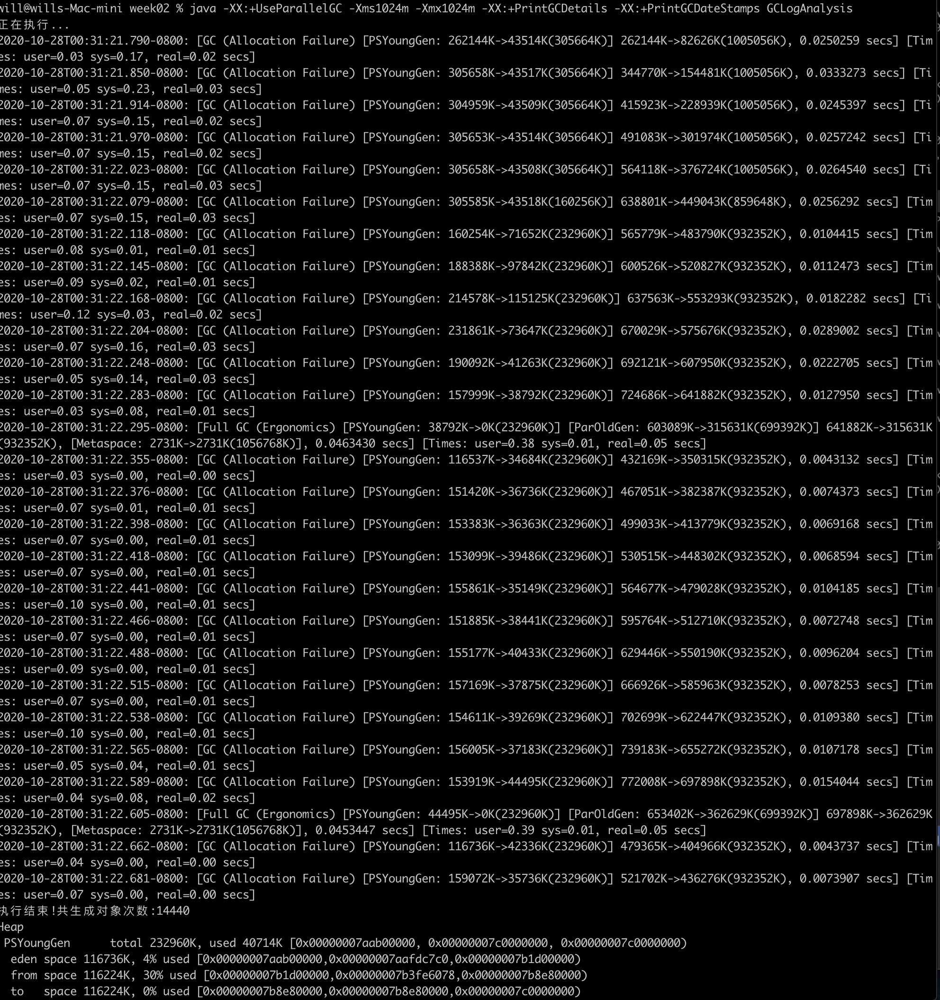

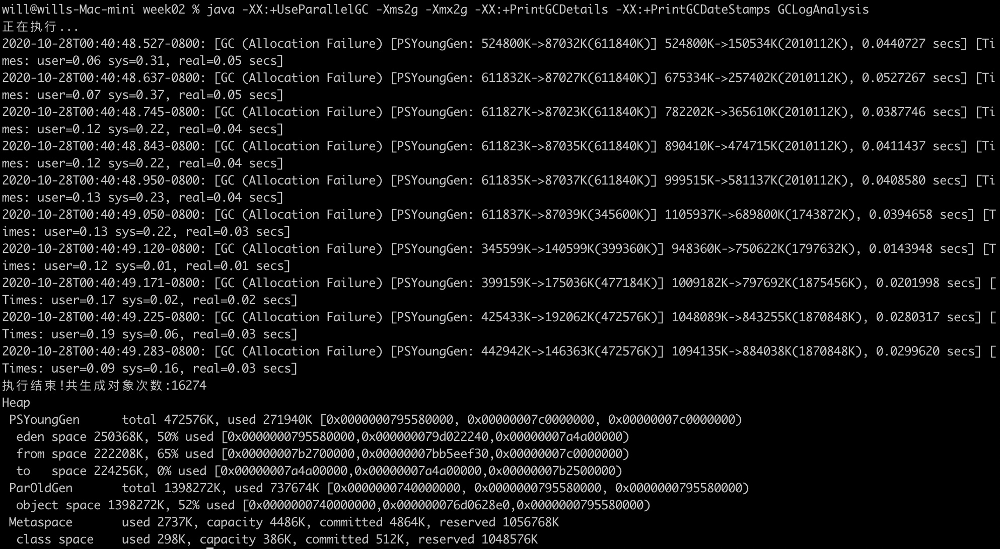

> 与串行GC对比GC时间和暂停时间变短
> Full GC young区从44m到0，old区从65m到36m
> young区数据在一次GC时大部分被回收掉，Full GC一般情况下存放的都是要么是正在使用，要么是已使用一段时间，所以它的存活时间比较长，每次回收的比较少

>在并行GC下young GC的时候只清理young区 old区不清理，这时候会把Eden区和S0区存活的对象复制到S1区，复制完了它里面的对象就没用了，整个全部回收掉，有部分对象提升到老年代，所以老年代会增加。下一次young GC会变成Eden区和当前有数据的存活区S1，它两存活的对象复制到S0里面，再把它两清空掉。当老年代比例特别高，不够用时发生Full GC，Full GC的时候会回收掉young区，再把老年代里面目前不活跃的数据回收掉

> 如果不配置Xms那么默认的起始堆内存会很小，第一次发生GC时间会提前

- CMS GC

  > java -XX:+UseConcMarkSweepGC -Xms1024m -Xmx1024m -XX:+PrintGCDetails -XX:+PrintGCDateStamps GCLogAnalysis

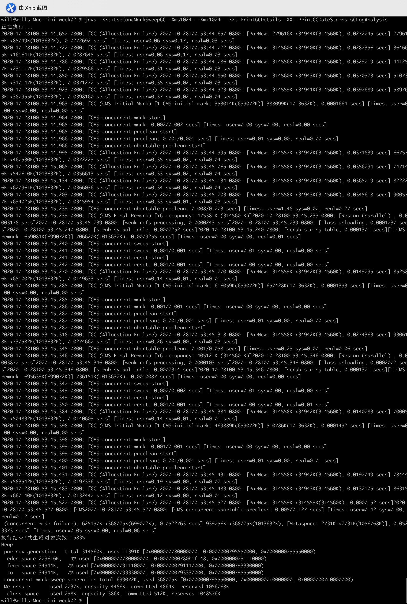

> CMS GC 处理阶段

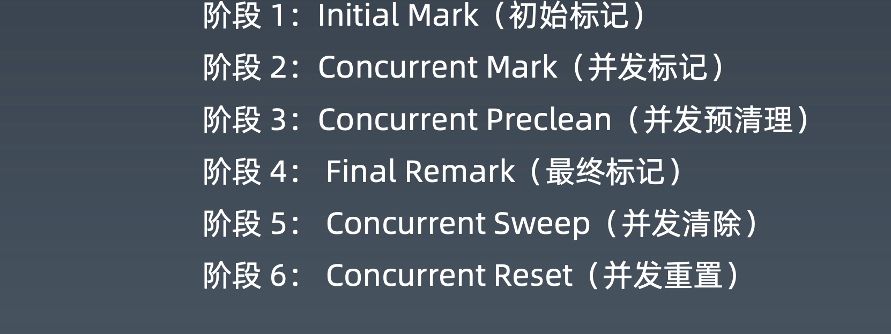

- Xms 和Xmx都为4g时和并行GC相比较

  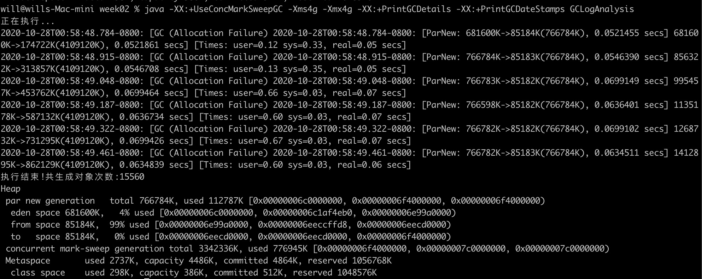

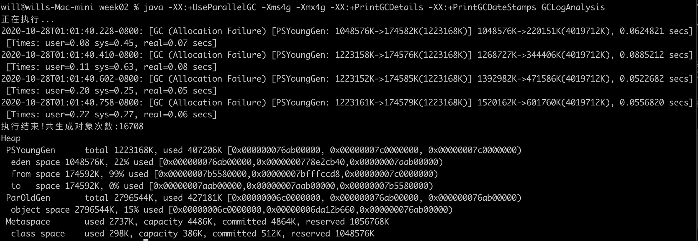

- G1 GC

  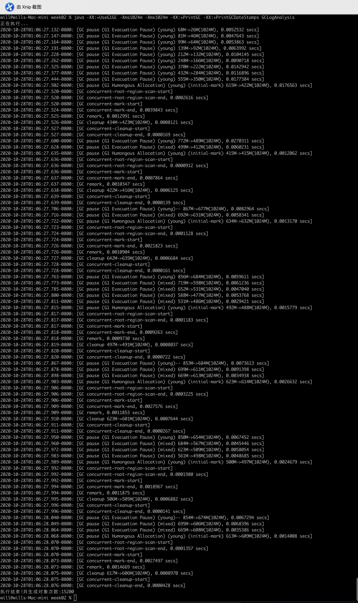

> G1 GC的步骤

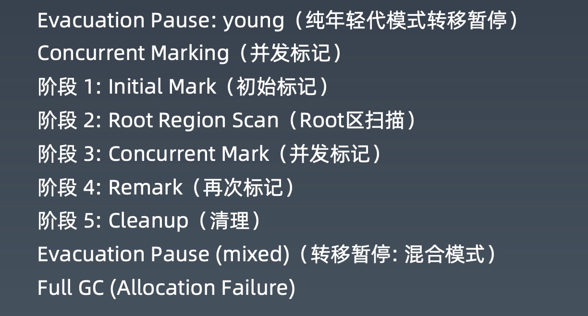

> Xms 和Xmx都为4g时和CMS GC相比较

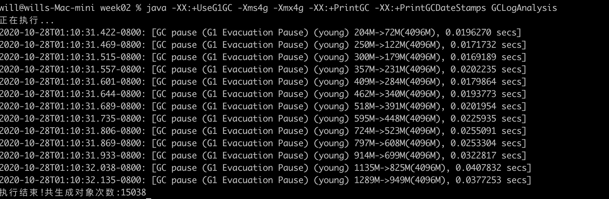

> 只有young GC 效率更高