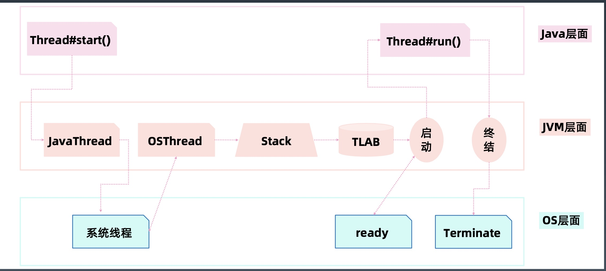
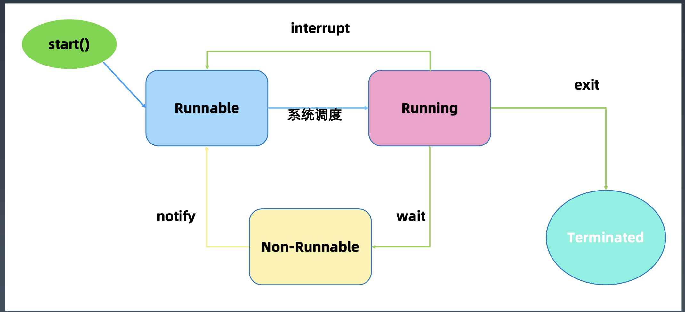
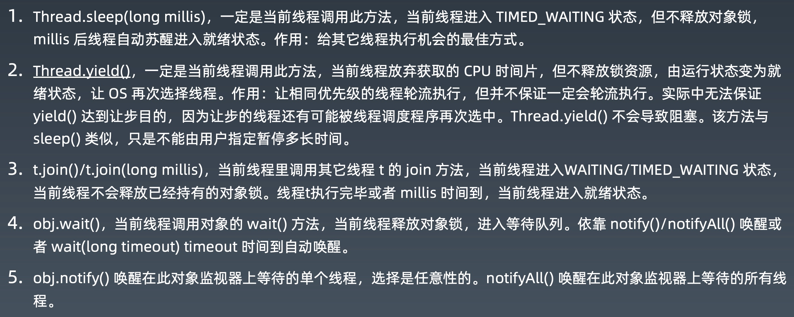

> Reactor模型在Netty中的实现是EventLoop
> EventLoopGroup绑定的是单个线程
> 默认不设置则为多线程模式，cpu核心的2倍
> 通过控制EventLoopGroup构造方法的参数，可以模拟不同的nio模型
> 单线程的EventLoop不停地轮询自己的事件队列
> 
- 多线程
> 多cpu核心意味着同时操作系统有更多的并行计算资源可以使用
> 操作系统以线程作为基本的调度单元
> 进程，操作系统基本的运行单位，进程内的资源相互间可以共享，共享内存 ，进程之前资源相互隔离
> 线程，cpu的基本调度单位
> 在linux中所有进程都是内核线程
> new Thread() 只在java代码层面操作，只有当它start之后才会在jvm层面创建java线程对象，同时再去调用操作系统的api，去创建一个操作系统的真实的线程，之后再分配jvm里面的方法栈，堆上的内存缓冲区，然后启动线程，开始运行里面的方法体，最终运行完关闭掉。

> 当new Runnable()时，直接调用的它的run方法，而不把它放在线程里，那就和调用普通类的方法是一样的，会在当前线程执行，和多线程没有关系。 
> Runnable本身是没有运行能力的，仅仅是定义了一个对象而已，真正是在thread.start()时才真正运行，但是将当前thread设置为守护线程，jvm发现当前的线程只有守护线程，进行回收，那么run的方法体就不执行。

- 线程状态

- Thread的状态改变操作

  

